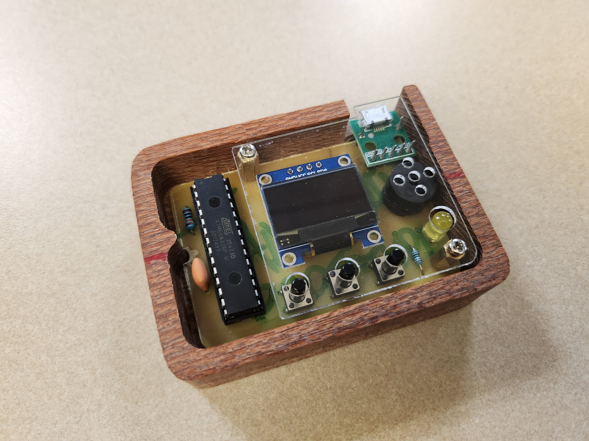
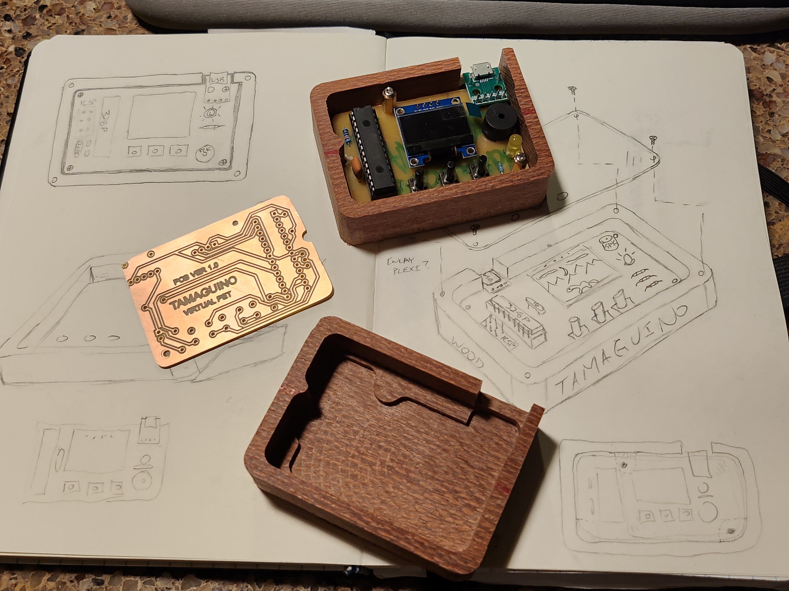
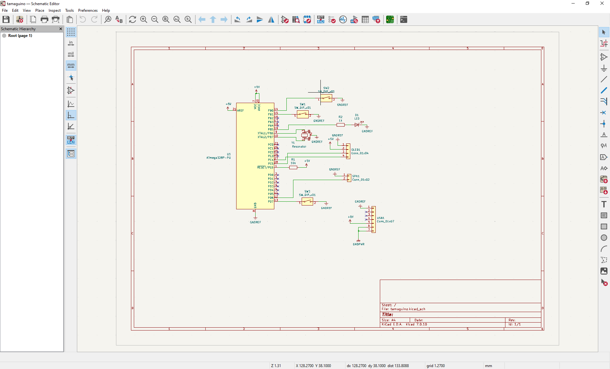
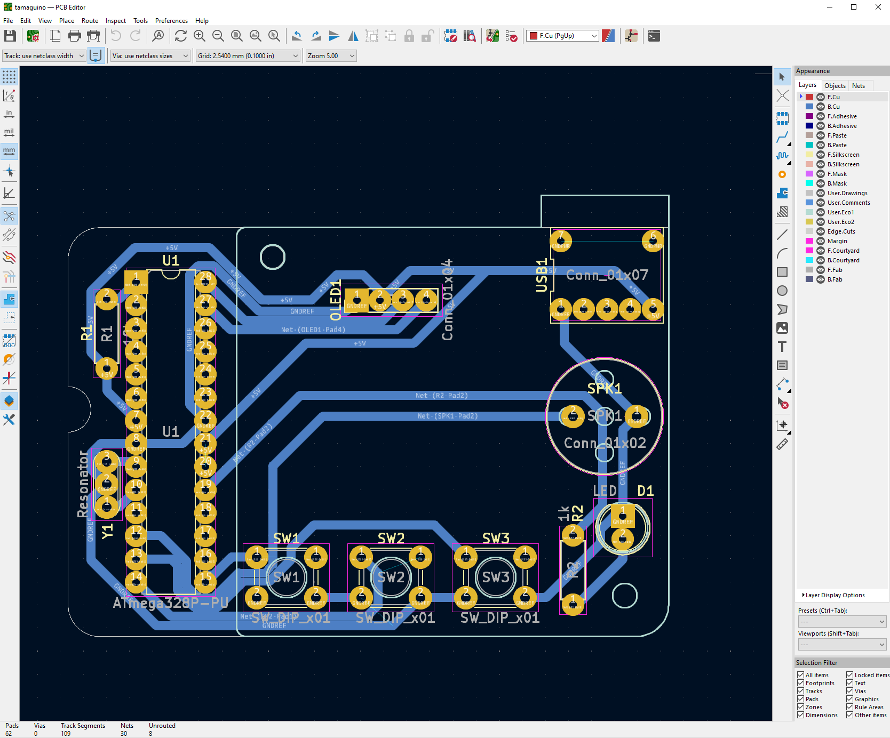
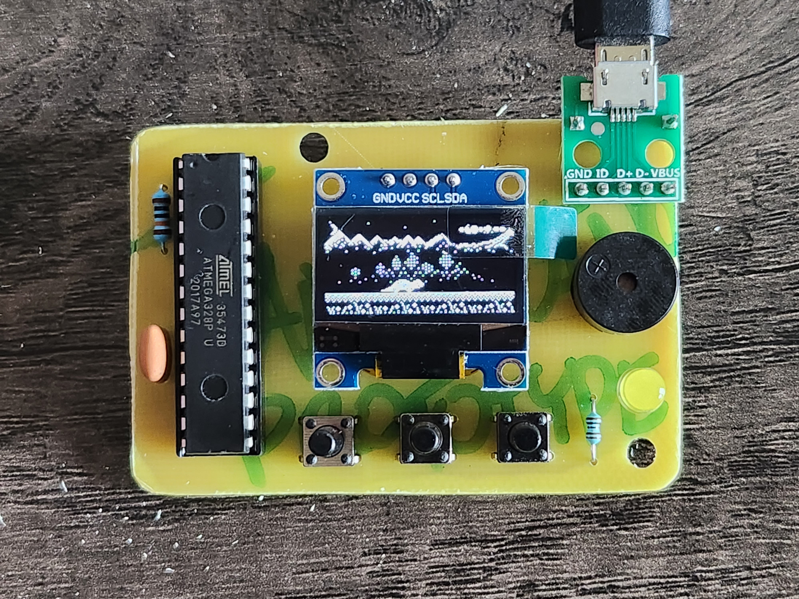
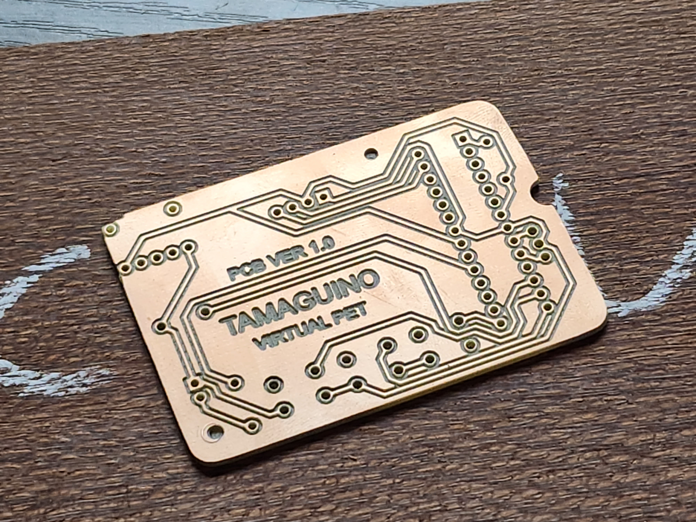
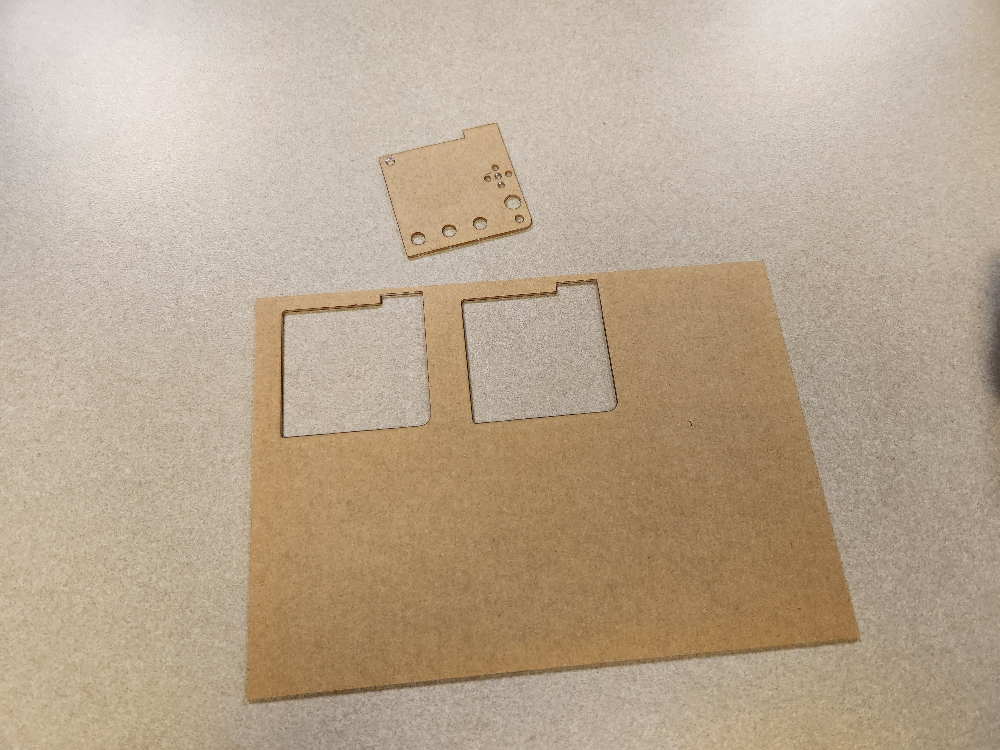
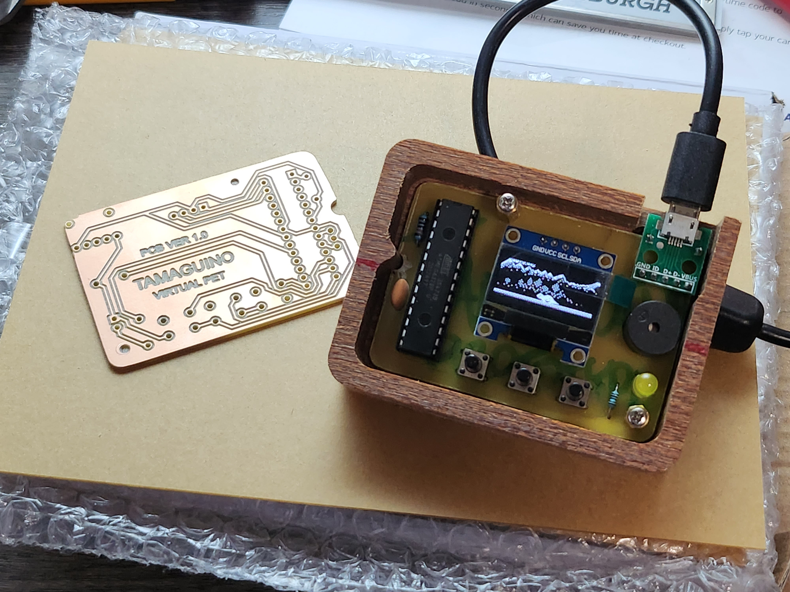
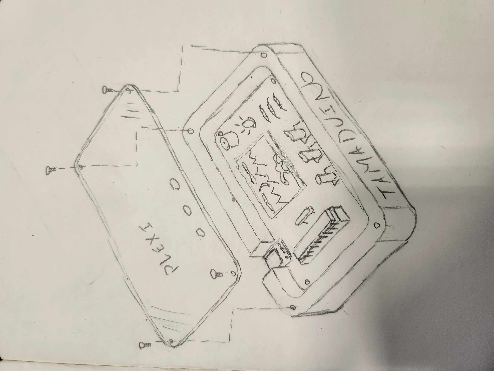

# Tamaguino-Hardware
### PCB and Case Design Repository

This github is an open-source hardware repository and buildlog to make a case and PCB assembly for my friend Alojz Jakob's Tamaguino virtual pet [firmware](https://alojzjakob.github.io/Tamaguino/). Feel free to use and edit the design, and to contact me if you would like fabricated parts. 

 

## Design

This project was planned as a 3-day sprint. One day was spent brainstorming and sketching a workable layout from available parts. The next day was spent drafting a schematic and practical, cuttable 3d models for the case and PCB using both KiCad and Fusion360. The third day was spent writing CAM toolpathing, fabricating the actual case and PCB from stock material, assembling and soldering parts together, and programming the Tamaguino firmware onto the ATmega328P microprocessor to finish the project. 

 
 

 
 

## Fabrication

An Australian Lacewood board was selected from a local hardwood store to make cases. One description used for the surface of this wood is "reptillian", so I thought it would be perfect to house a dinosaur pet. Fusion360 was used to create the CAM instructions for the CNC machine using the designed models. A Onefinity CNC machine was used to process the wood board and some PCB blank material into actual cases and PCBs. 

 
 

## Repository and BOM

The [KiCad folder](./kicad7.0) includes the schematic and PCB layout, as well as a plotOutput subfolder with .dxf and .svg exports. KiCad's plotOutput files were used directly in Fusion360 to program the CAM instructions to cut the PCBs. An earlier version of KiCad was used during the project, and the design files have now been resaved with KiCad v7.0. The Eco1 User layer was used to draw the plexiglass shield, and the tamaguino-Eco1_User.svg file in the plotOutput subfolder was used by a laser cutter to cut the actual shield. The case was drawn in Fusion360 using plotOutput files as reference. It has been included in the repository as an .stl file which may be machined or 3d printed. A drill must be used to widen screw holes to match M2 or whichever screw is selected to hold the PCB in place, the model only has a small divot indicating where the holes belong.

 
 

### Components used in build:

These are the actual parts used in the pictured assemblies. As some of the parts came in kits or multipacks, cheaper alternatives could be found using these parts as reference.

* Micro USB Adapter: https://www.amazon.com/gp/product/B07W844N43
* I2C Oled Screen: https://www.amazon.com/gp/product/B07VDXYDVY
* ATmega328P: https://www.digikey.com/en/products/detail/microchip-technology/ATMEGA328P-Pdigikey%2028dip%20socketU/1914589
* 28-Dip Socket: https://www.digikey.com/en/products/detail/adam-tech/ICS-328-T/9832859
* 16MHz Ceramic Resonator: https://www.adafruit.com/product/1873
* 6mm Buttons: https://www.adafruit.com/product/1490
* 6mm M2 Standoffs and Screws from Multikit: https://www.amazon.com/gp/product/B075K3QBMX
* Speaker: https://www.amazon.com/gp/product/B01GJLE5BS/
* Generic LED from Kit: https://www.amazon.com/gp/product/B07DQQCXV9
* As well as both a 1k and 10k ohm resistor.

 
 

### A Note on Programming

As this design uses a bare processor chip, another AVR is used to program the ATmega328P. In my case, I used an Arduino flashed with ArduinoISP as a programmer and another Arduino board with the processor removed as a socket to host the bare 328P. A breadboard could instead be used for the socket to program, as there just needs to be an ICSP connection between the programmer and socket. 

 
 

Thanks for taking a look!

